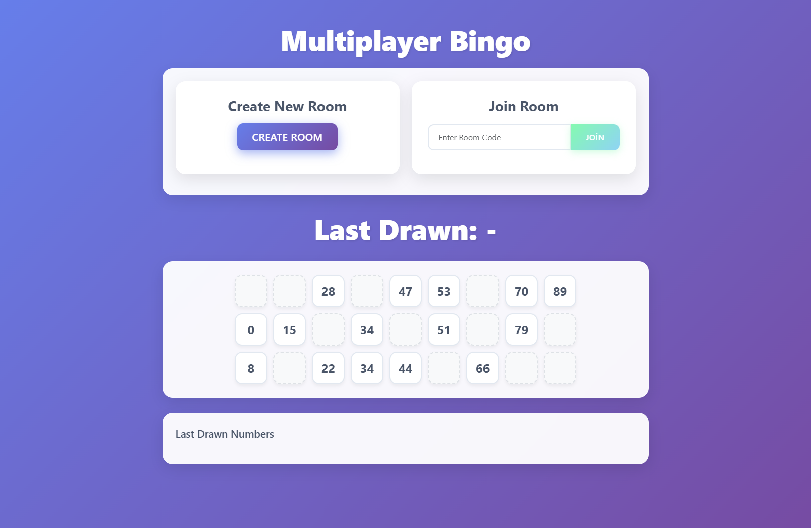
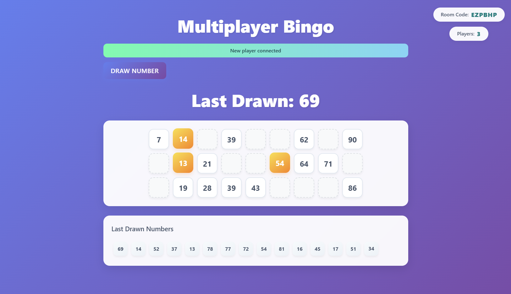
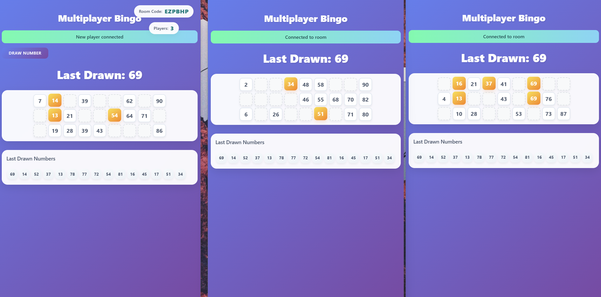

# 🎮 Multiplayer Bingo - P2P Real-time Game


A modern, real-time multiplayer Bingo game that operates entirely on P2P (Peer-to-Peer) technology. No server required - just pure browser-to-browser communication!

## ✨ Features

- **🔥 Pure P2P Communication**: Using WebRTC through PeerJS for direct player-to-player connection
- **🎯 Real-time Number Drawing**: Synchronized number drawing with animations across all players
- **🎨 Modern UI/UX**: Beautiful, responsive design with smooth animations
- **🔒 No Server Required**: Works completely P2P, no backend needed
- **📱 Mobile Responsive**: Play on any device, any screen size
- **🚀 Easy to Join**: Simple 6-character room codes for quick game access

## 🎯 How It Works

1. **Room Creation**:
   - Host creates a room and gets a unique 6-character code
   - Room code can be shared with other players

2. **Joining a Game**:
   - Players enter the 6-character room code
   - Direct P2P connection established with the host

3. **Gameplay**:
   - Host draws numbers
   - All players see synchronized number drawing animations
   - Numbers are marked automatically on players' cards
   - Track drawn numbers in real-time

## 🚀 Technology Stack

- **Frontend**: HTML5, CSS3, JavaScript
- **P2P Communication**: PeerJS (WebRTC)
- **UI Framework**: Bootstrap 5
- **Animations**: CSS3 Animations & Transitions

## 🎮 Live Demo

Try it out: [Multiplayer Bingo Demo](https://bilgeozan.com/bingo)

## 📸 Screenshots


*Room creation and joining interface*


*Active gameplay with drawn numbers*


*Bingo on 3 players*

## 🛠️ Setup and Installation

1. Clone the repository:
```bash
git clone https://github.com/Nrkozan/P2P-Real-time-Game-Multiplayer-Bingo.git
```

2. Open `bingo.html` in a modern web browser

That's it! No server setup or installation required.

## 💡 How P2P Works in This Project

The game utilizes WebRTC through PeerJS to establish direct peer-to-peer connections between players:

1. **Room Creation**:
   - Host generates a unique PeerJS ID
   - This ID is converted to a user-friendly 6-character room code

2. **Connection Process**:
   - When a player joins, their browser connects directly to the host
   - All game data (drawn numbers, timing) flows through this P2P connection
   - No central server involved in gameplay

3. **Real-time Synchronization**:
   - Number drawings are synchronized using timestamp-based coordination
   - Animations play simultaneously for all connected players
   - State is maintained across all peers

## 🤝 Contributing

Contributions are welcome! Here's how you can help:

1. Fork the repository
2. Create a feature branch (`git checkout -b feature/AmazingFeature`)
3. Commit your changes (`git commit -m 'Add some AmazingFeature'`)
4. Push to the branch (`git push origin feature/AmazingFeature`)
5. Open a Pull Request

## 📝 License

This project is licensed under the MIT License - see the [LICENSE](LICENSE) file for details.

## 🌟 Show Your Support

If you find this project interesting or useful, please consider giving it a star ⭐️ on GitHub!

## 📧 Contact

Bilge Ozan Per - [@LinkedIn](https://www.linkedin.com/in/ozanper/)

Demo Link: [https://bilgeozan.com/bingo](https://bilgeozan.com/bingo)

---

Made with ❤️ and JavaScript 